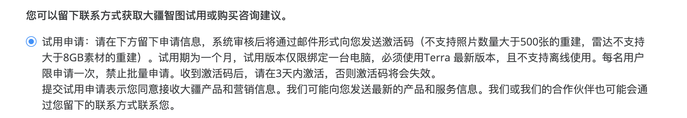
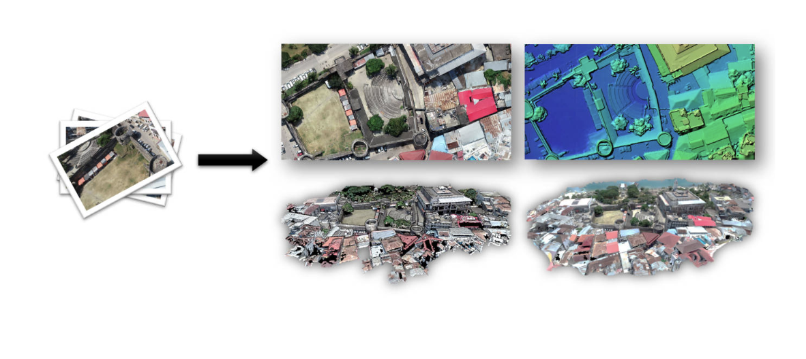
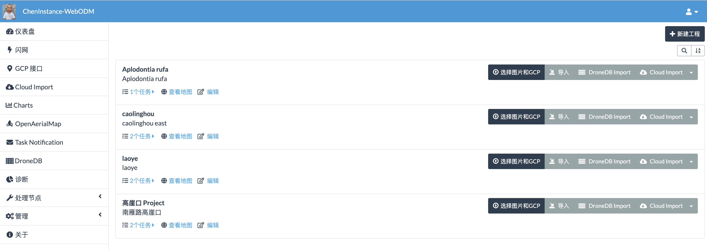
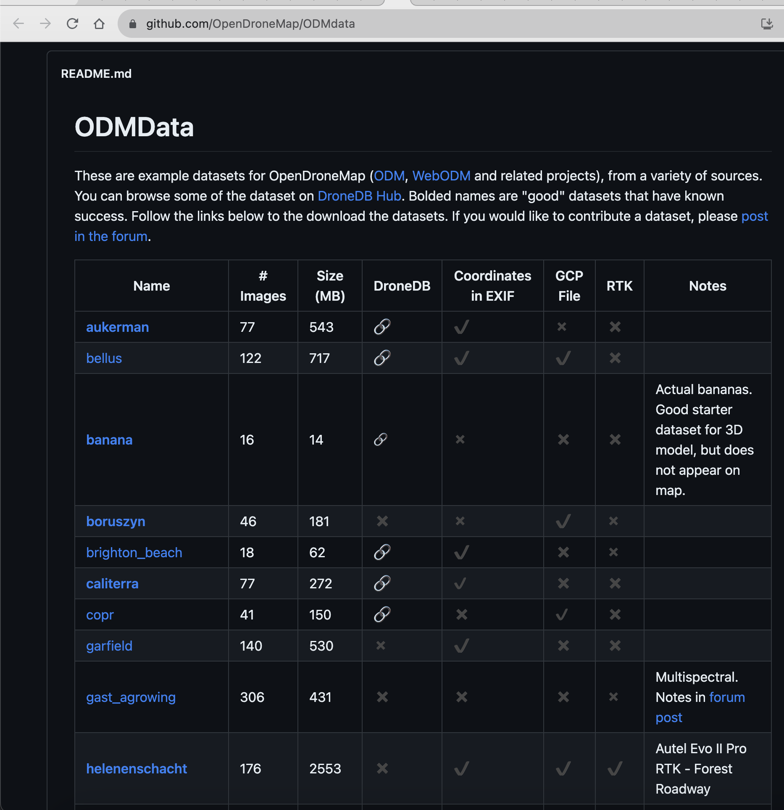
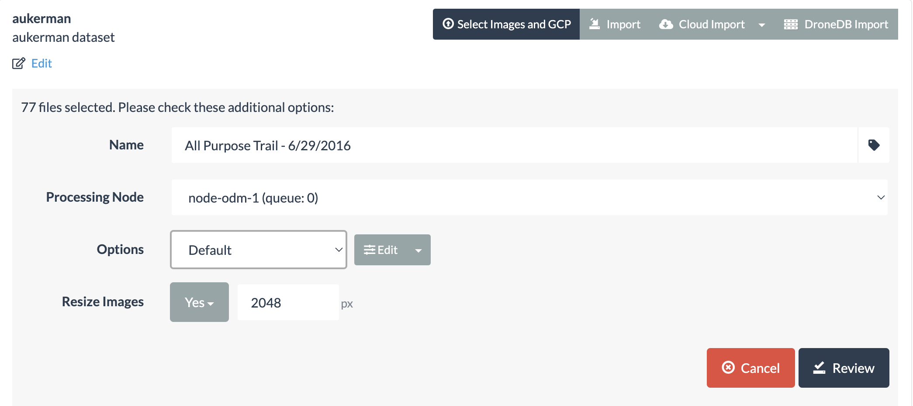
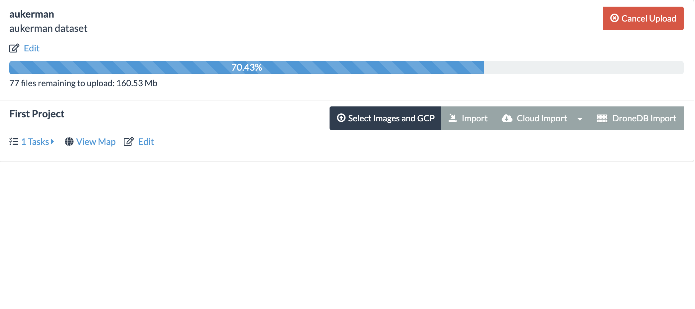
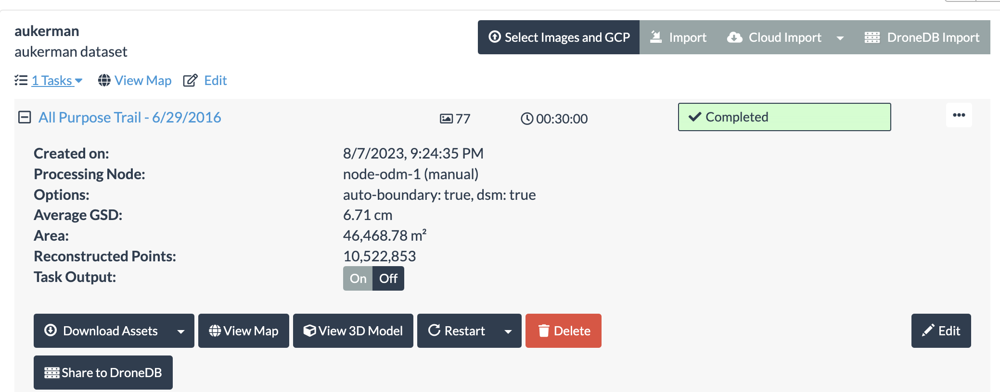
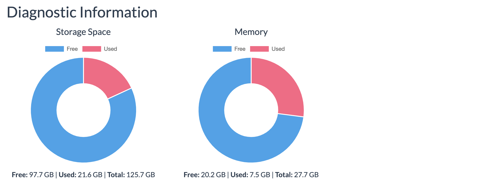
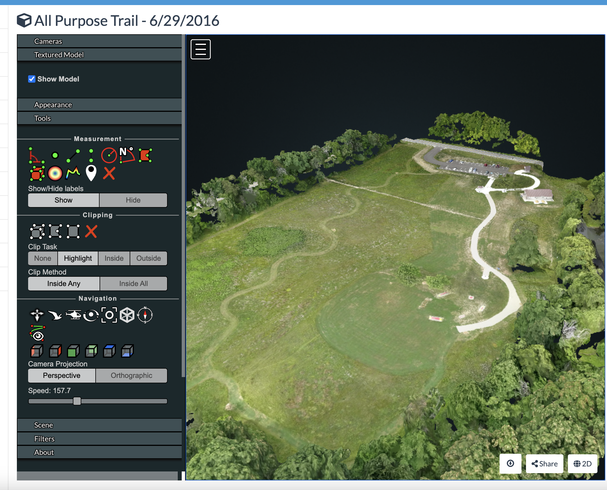

无人机测量，刚入门的话，可以尝试WebODM。

当我们拥有了无人机之后， 除了拍摄一些航拍图片、视频之外，有没有想更进一步，把这些图片做进一步的处理，把所拍到的景观变成数字化模型来保存呢？ 如果你曾经这么想过， 而且还不知道如何对无人机图片进行进一步的处理， 那么请继续阅读下去。

无人机的镜头，其实跟我们的手机镜头没有太大的区别，只是拍摄的角度不一样，无人机拍出来的照片， 属于非量测影像（non-metric imagery），而借助于一些软件， 例如[大疆智图（dji-terra）](https://enterprise.dji.com/cn/dji-terra)，就对大疆无人机拍摄的航空摄影图片，提供了一站式的解决方案。


>
>大疆智图是一款以摄影测量技术为核心的的三维重建软件，可支持各类可见光精准高效二三维重建、大疆激光雷达的数据处理。 大疆智图与大疆>行业无人机和负载可形成完美搭配，形成面向测绘、电力、应急、建筑、交通、农业等垂直领域完整的应用解决方案。

但是， 大疆智图毕竟是商业软件，虽然有试用，但是条件是很苛刻的。对于初学者而言，一开始就购买这种软件是不合适的。


幸好，在开源世界，我们找到了一款开源航空摄影处理软件，开源的OpenDroneMap ，可以将这些测影像转换成三维地理建模数据，并应用在地理信息系统中， 这样会充分发挥无人机的能力。

刚才说到了#OpenDroneMap#（简称，ODM），这是用于处理航空图像的开源工具包，ODM 将简单的傻瓜相机图像转换为可与其他地理数据集结合使用的二维和三维地理数据。简单理解，它是一个以图像作为输入并生成各种地理参考资源作为输出的程序，例如地图和 3D 模型，如下图所示。

具体而言，OpenDroneMap 可以将航拍图像处理为下面几种格式的数据：

- 点云（Point Clouds）

- 纹理数字表面建模（Textured Digital Surface Models）

- 正射校正影像（Orthorectified Imagery）

- 数字高程模型（Digital Elevation Models）

但是ODM是一个命令行工具， 普通人用不了， 因此WebODM 就出现了。WebODM是一个开源的免费三维重建软件,支持通过网页界面处理无人机影像并生成三维模型,使用Docker可以便捷部署。

目前WebODM 是开源的，免费使用， 可以在Windows/Linux/Mac 下安装和使用， 但是Windows/Mac下的安装包是需要收费的，  如果有较强的计算机能力， 也可以通过Docker 来安装，完全免费。

在这里展示的是Mac 版的WebODM， 当安装成功，通过命令行运行./webodm.sh start 启动成功之后，在本地端口8000就可以看到这个页面，如图所示， 之前我的环境里一直显示的是英文，还以为不支持中文显示， 后来把浏览器的显示语言改成中文，就能正常显示了。

安装好WebODM 之后， 就可以新建Project ， 对无人机图片进行处理了。WebODM 目前提供了一些 [ODMdata示例图片集](https://github.com/OpenDroneMap/ODMdata), 如图 。

这里示范了第一个数据集，aukerman，这是一个位于美国俄亥俄州克利夫兰市的一个地点，有77张图片， 图片四～图片七展示了这个数据集在我的电脑的运行情况， 






总共用时30分钟， 内存使用情况如图八所示。



最后，看看最后运行的结果吧。 输出结果基本上分为2D 和3D 数据两种， 在2D 数据上， 如图九所示， 可以查看正射影像（othophoto）。 

啥？ 你问什么是正射影像？

 ```正射影像是一种经过几何纠正（比如使之拥有统一的比例尺）的航摄像片，与没有纠正过的航摄像片不同的是，人们可以使用正射影像量测实际距离，因为它是通过像片纠正后得到的地球表面的真实描述。 与传统的地形图相比，正射影像或正射影像图（DOM）具有资讯量大、形象直观、易于判读和现势性强等诸多优点，因而常被应用到地理信息系统（GIS）中。 ```

在正射影像中，可以进行距离测量、面积测量， 如图十所示，测量了图片里的停车场的面积。

WebODM 还提供了3D 模型， 下图就是一个纹理数字表面建模的模型。 如果做到了这一步， 基本上这个拍摄对象的所有特征都已经做到数字化了。 

在三维数字模型的加持下，我们可以永久的把无人机拍摄的内容数字化， 三维格式永久保存， 是不是很酷？ 即使时间过去了很久， 这个模型依然会存在，这对于保留一些建筑的记忆，很有意义。

有想要做自己的三维模型的头条读者们， 可以找我来生成，免费的哦。


